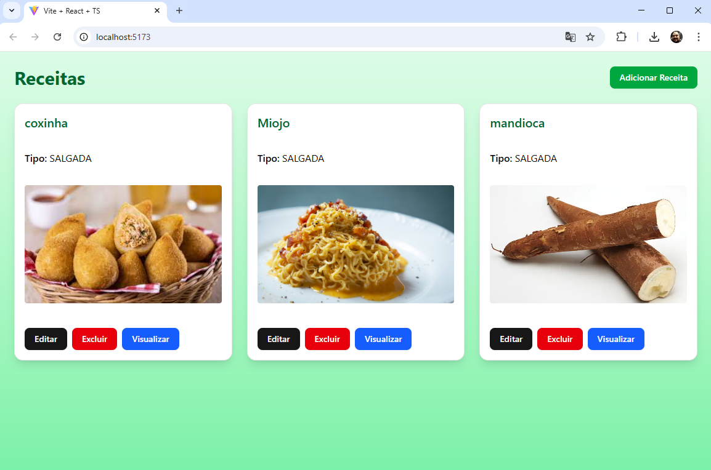
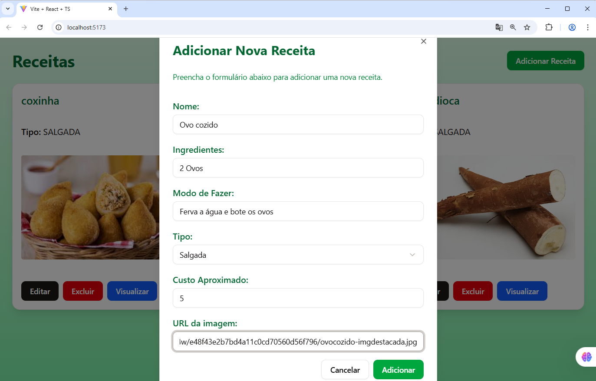
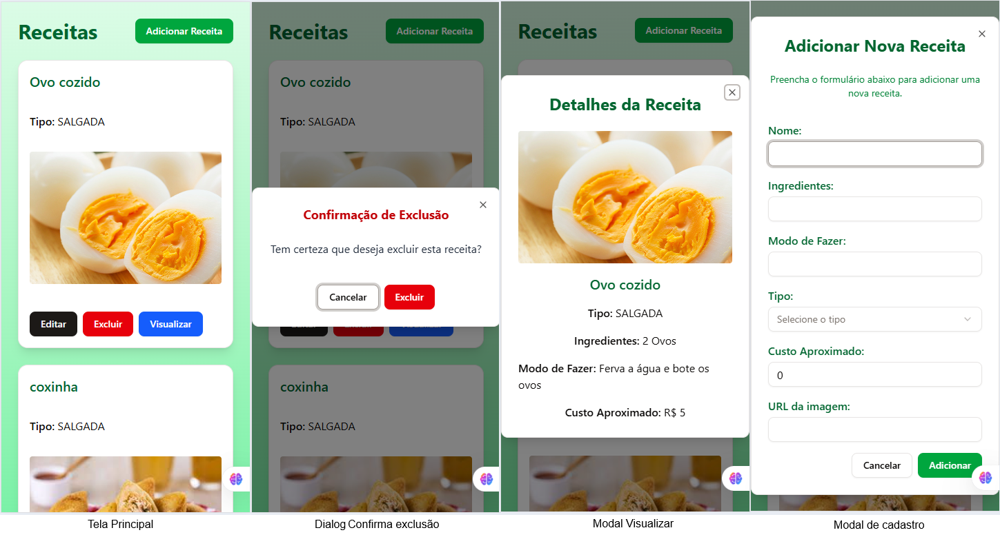

# Receitas Web - Livro de receitas

Este é um projeto de um livro de receitas online, onde você pode encontrar, adicionar e compartilhar suas receitas favoritas. O objetivo deste projeto é criar uma plataforma simples e intuitiva para entusiastas da culinária.

## Objetivo
O objetivo deste site foi estudar Vite, React, TypeScript e Tailwind CSS, aplicando esses conhecimentos na prática para desenvolver um projeto funcional e útil.

## Tecnologias
- Vite
- React
- TypeScript
- Tailwind CSS
- Shadcn UI

## Como testar localmente
1. Clone este repositório:
2. Abra com VsCode
3. Instale as dependências:
    ```bash
    npm install
    ```
4. Inicie o servidor de desenvolvimento:
    ```bash
    npm run dev
    ```
5. Abra seu navegador e acesse `http://localhost:5173` para ver o site em funcionamento.

## Screenshots





## Implantado
Implantado com gh-pages: [https://wellifabio.github.io/receitas-web-2025/](https://wellifabio.github.io/receitas-web-2025/)